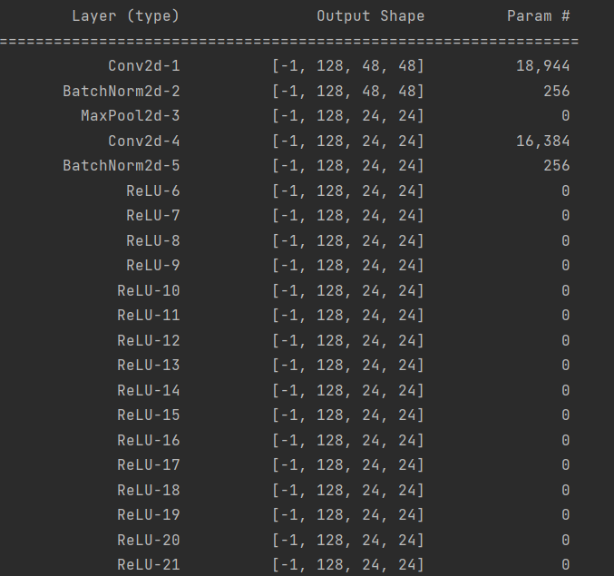

# SimCLR-v1
## Description

**SimCLR** is a self-supervised learning method, using pairs of positive samples (or views) to calculate contrastive loss and maximize the cosine similarity of positive pairs.

This is a simple implement of SimCLR v1 in PyTorch, which codes draw heavily on the following code: [official code](https://github.com/google-research/simclr)(NT-Xent implement references) and [sthalles's work](https://github.com/sthalles/SimCLR)(model intrance design & data argument process).

Comparing to sthalles's work, I use accelerate to boost training, and the training on cpu is __not available__.

Meanwhile, some changes were made in this project:

1. The Encoder will not be frozen via the fine-tune parse. Now the whole network will be fine-tuned in a slow learning rate (default 1e-4) with NAdam optimizer.
2. Image size of the fine-tune dataset should be the same as the pre-train dataset to prevent unexpected accuracy loss. The transforms of ```SimCLR_classifier_finetune``` function should be modified on your demand.
3. To have a wider ResNet-50 like SimCLR paper, you can use ```--backbone 'simclr_resnet50' --width-multiplier 2``` options to use ResNet-50×2 as backbone (or Encoder), multiple the dimension of hidden layers and the feature extraction layer(flatten output after average pooling).
   **Note: the option --width-multiplier will only work with backbone 'simclr_resnet50'**
4. There are too many parameters in pre-train process, so the 3\*3 convolution is replaced by a **depth-wise convolution** in bottleneck on simclr_resnet50 backbone, which could reduce about 50% of parameters comparing to a classic ResNet-50 implement when the option width-multiplier >= 2. If you want to use 3\*3 convolution, modify the arg ```group=1``` of the return conv in [depthwise_conv](https://github.com/RDR2Blackwater/SimCLR-v1/blob/master/backbones/resnet_series.py#L21)

## Running a SimCLR project

You can start a SimCLR training like:

```//Bash
python3 main.py --backbone 'resnet50' --epochs 200 --save-checkpoint 50
```

and start the pre-train process & fine-tune process

Comments of args are given in [main.py](https://github.com/RDR2Blackwater/SimCLR-v1/blob/master/main.py)

## Transfer learning via fine-tune

The model will learn features using SimCLR v1 in ```STL-10 unlabeled``` dataset in **SimCLR_pretrain**, and then **SimCLR_classifier_finetune** will execute the transfer learning via fine-tune in CIFAR-10 dataset. The nonlinear projection head will be replace with a single linear head, and the whole network will be fine-tuned during training.

I evaluated SimCLR v1 models with different epochs & width-multiplier, and tested their top-1 accuracy while training on 10% and 100% CIFAR-10 train dataset. In comparison, I also tested the top-1 accuracy while training on 10% and 100% CIFAR-10 train dataset using origin ResNet-50 as baseline. 

Stronger data augmentation will greatly benifit the fine-tune. However, to ensure fairness, all models use the same transformation strategy in the fine-tune phase: Resize and CenterCrop

| Feature extractor | Backbone architecture | Feature dimensionality | Projection head dimensionality | pre-train batchsize | pre-train epochs | fine-tune epochs | Training dataset percentage | Top-1 Accuracy |
| ----------------- | --------------------- | ---------------------- | ------------------------------ | ------------------- | ---------------- | ---------------- | --------------------------- | -------------- |
| N/A | ResNet-50 | 2048 | N/A | N/A | N/A | 100 | 10% | 44.05% |
| N/A | ResNet-50 | 2048 | N/A | N/A | N/A | 100 | 100% | 77.85% |
| SimCLR v1 | ResNet-50 | 2048 | 1024 | 256 | 50 | 100 | 10% | 71.58% |
| SimCLR v1 | ResNet-50 | 2048 | 1024 | 256 | 100 | 100 | 10% | 71.75% |
| SimCLR v1 | ResNet-50 | 2048 | 1024 | 256 | 100 | 100 | 100% | 86.35% |
| SimCLR v1 | ResNet-50×2 (simclr_resnet50) | 4096 | 1024 | 256 | 100 | 400 | 10% | 78.69% |
| SimCLR v1 | ResNet-50×2 (simclr_resnet50) | 4096 | 1024 | 256 | 100 | 500 | 10% | 77.85% |

Although longer pre-training will benefit the backbone, small batch size would limit the feature extraction, and leads to optimization fail.


## Known issues

When I analyse the structure and params of the implemented simclr_resnet50, the activation function of bottleneck will be repeated for 16 times after every batch norm layer.



I have no idea about why it happens. Though multiple ReLU activation functions won't change the origin value, it may delay the forward process during training.

## References:

[A Simple Framework for Contrastive Learning of Visual Representations](https://arxiv.org/abs/2002.05709)

